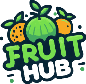

<div align="center">



# 🍓 Fruit Hub
### *Fresh Fruits, Delivered to Your Door*

> A simple and elegant Flutter app for browsing and ordering fresh fruits online, built as a personal training project to practice clean architecture and Firebase integration.

<br/>

[](https://flutter.dev)
[](https://firebase.google.com)
[](https://dart.dev)
[]()

[](LICENSE)
[]()
[]()

</div>

---

## 📋 Table of Contents

- [About The Project](#-about-the-project)
- [Key Features](#-key-features)
- [Tech Stack](#-tech-stack)
- [Screenshots](#-screenshots)
- [Getting Started](#-getting-started)
  - [Prerequisites](#prerequisites)
  - [Installation](#installation)
- [Project Structure](#-project-structure)
- [Contributing](#-contributing)
- [Author](#-author)
- [License](#-license)

---

## 💡 About The Project

**Fruit Hub** is a Flutter-based mobile shopping app focused entirely on fresh fruits. It was built as a personal/training project to practice real-world mobile app development — covering authentication, Cubit state management, Firebase integration, a full shopping cart and checkout flow, and clean UI/UX design.

The app allows users to browse fruit categories, search for specific items, add products to their cart, complete checkout, track order history, leave reviews, and manage their account — all wrapped in a clean, fruity, and intuitive interface.

---

## ✨ Key Features

| Feature | Description |
|---------|-------------|
| 🍎 **Fruit Catalog** | Browse a wide variety of fresh fruits organized by category |
| 🗂️ **Categories Filter** | Filter products easily by fruit category |
| 🔍 **Smart Search** | Quickly search for any fruit by name |
| ⭐ **Reviews & Ratings** | View and leave ratings/reviews on products |
| 🛒 **Shopping Cart** | Add items to cart, adjust quantities, and manage your order before checkout |
| 💳 **Checkout** | Smooth and simple checkout flow to complete purchases |
| 📦 **Order History** | Track and review all your previous orders |
| 🔐 **Authentication** | Secure sign up, login, and password recovery via Firebase Auth |
| ✉️ **Email Verification** | Verify your account via email before accessing the app |
| 🕒 **Recently Viewed** | Keep track of items you've recently browsed |
| 👤 **User Profile** | Manage your personal account information |
| 🎨 **Onboarding Experience** | Smooth onboarding flow introducing the app on first launch |
| 📱 **Responsive UI** | Clean, modern design optimized for mobile screens |

---

## 🛠 Tech Stack

### Frontend (Mobile)
- **[Flutter](https://flutter.dev/)** — Cross-platform mobile development (Android & iOS)
- **Dart** — Programming language

### State Management
- **[Cubit (Bloc)](https://bloclibrary.dev/)** — Predictable state management for clean separation between UI and business logic

### Backend & Services
- **[Firebase Authentication](https://firebase.google.com/products/auth)** — User sign up, login & email verification
- **[Cloud Firestore](https://firebase.google.com/products/firestore)** — Real-time NoSQL database for products, cart, orders & reviews
- **[Firebase Storage](https://firebase.google.com/products/storage)** — Storing product images and assets

---

## 📸 Screenshots

<div align="center">


</div>

---

## 🚀 Getting Started

### Prerequisites

Make sure you have the following installed on your machine:

- [Flutter SDK](https://docs.flutter.dev/get-started/install) `>=3.0.0`
- [Firebase Account](https://firebase.google.com/) (free tier is enough)
- [Git](https://git-scm.com/)
- Android Studio / Xcode (for running the emulator)

---

### Installation

#### 1️⃣ Clone the Repository

```bash
git clone https://github.com/OmarNabilali/Fruits-Hup.git
cd Fruit-Hub
```

#### 2️⃣ Install Dependencies

```bash
flutter pub get
```

#### 3️⃣ Setup Firebase

1. Create a new project on the [Firebase Console](https://console.firebase.google.com/)
2. Enable **Authentication** (Email/Password)
3. Enable **Cloud Firestore** and **Firebase Storage**
4. Install the FlutterFire CLI and configure your project:
   ```bash
   dart pub global activate flutterfire_cli
   flutterfire configure
   ```
   This will automatically generate the `firebase_options.dart` file and add the required config files:
   - `android/app/google-services.json`
   - `ios/Runner/GoogleService-Info.plist`

> ⚠️ These Firebase config files are excluded via `.gitignore` and must be generated locally — **never commit them to GitHub**.

#### 4️⃣ Run the App

```bash
flutter run
```

---

## 📁 Project Structure

```
Fruit-Hub/
├── lib/
│   ├── core/                # Shared utilities, constants, theming
│   │   ├── widgets/
│   │   ├── utils/
│   │   └── theme/
│   ├── features/
│   │   ├── auth/             # Login, sign up, password recovery (Cubit)
│   │   ├── onboarding/       # Onboarding & splash screens
│   │   ├── home/             # Home screen, categories & filtering (Cubit)
│   │   ├── search/           # Search functionality (Cubit)
│   │   ├── product_details/  # Product details & reviews (Cubit)
│   │   ├── cart/              # Shopping cart (Cubit)
│   │   ├── checkout/          # Checkout flow (Cubit)
│   │   ├── orders/            # Order history (Cubit)
│   │   └── profile/          # User profile management (Cubit)
│   ├── firebase_options.dart # Generated by FlutterFire CLI (gitignored)
│   └── main.dart
│
├── assets/
│   └── images/                # App images & screenshots
│
├── android/
├── ios/
├── pubspec.yaml
└── README.md
```

---

## 🤝 Contributing

This started as a personal training project, but contributions, suggestions, and feedback are always welcome! 🎉

1. **Fork** the repository
2. Create a new **branch** for your feature:
   ```bash
   git checkout -b feature/amazing-feature
   ```
3. **Commit** your changes:
   ```bash
   git commit -m "feat: add amazing feature"
   ```
4. **Push** to your branch:
   ```bash
   git push origin feature/amazing-feature
   ```
5. Open a **Pull Request** 🙌

---

## 👨‍💻 Author

<div align="center">

| | Name | Role |
|--|------|------|
| 👤 | **Omar Nabil** | Developer |

[](https://github.com/omar-nabil)

</div>

---

## 📄 License

This project is licensed under the **MIT License** — see the [LICENSE](LICENSE) file for details.

---

<div align="center">

Made with ❤️ and 🍉 by Omar Nabil

⭐ If you found this project helpful, please consider giving it a **Star**!

</div>
